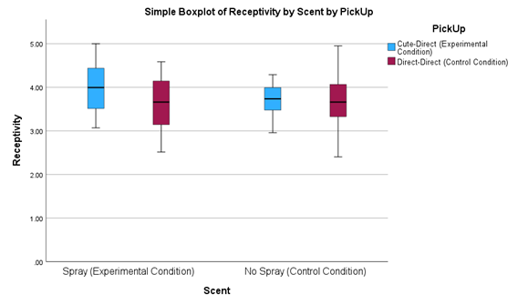
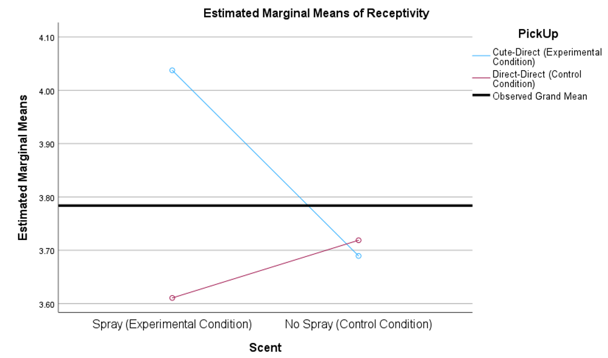
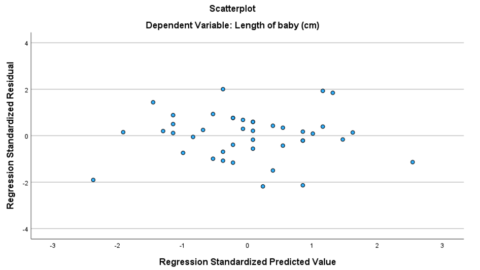
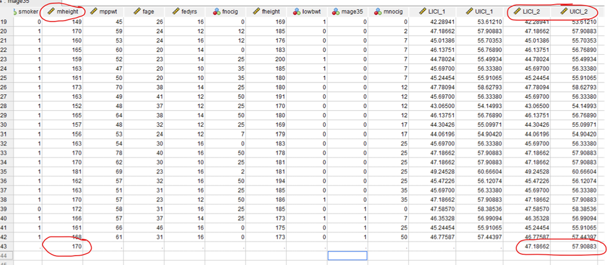

```{r setup, include=FALSE}
knitr::opts_chunk$set(echo = TRUE, warning = FALSE, message = FALSE)
```

In this file, I collected the main projects about Data Analysis done using SPSS and R, during the Data Analysis Training Program offered by Brainnest, which I attended from April 9 to May 6, 2023. The content is divided according to the datasets I used:

* `PickUpLines` dataset;
* `Birthweight` dataset;
* `Cholesterol` dataset.


# `PickUpLines` dataset

The main research question of this section is: **How do pick-up lines and a person’s scent influence relationship initiation?** <br> To answer this question, I broke it down into intermediate steps and used the `PickUpLines` dataset, and specifically the following variables:

* `PickUp`: style of pickup lines: 1 (cute-direct) or 2 (direct-direct);
* `Scent`: it takes value 1 (Spray) if that person actually wore androstadienone spray and 2 (No Spray) otherwise;
* `Receptivity`: it represents the rating of the reaction and the receptivity of the person who was asked out: the higher the value of this variable, the more we think that the method worked. Therefore, it is our measure of success.


## Assessing the effectiveness of the cute-direct approach 

The first question I answered is: is there any evidence to suggest that the cute-direct pick-up approach will lead to more relationship receptivity than the direct-direct approach?

To choose which test to conduct to answer the question, I firstly checked the assumptions of the independent-samples t-test:

* Data are measured at least at the interval level. This assumption is satisfied, since `Receptivity` is a continuous variable;
* Scores in the two cells are independent, since they come from different people; 
* Data are normally distributed in each cell or, if slightly non-normal, the two distributions are similarly skewed.<br> Normality is assessed using Shapiro-Wilk’s normality test for each cell. It is found that receptivity is normally distributed in the Direct-Direct cell ($p = .871$), while it is not in the Cute-Direct cell ($p < .001$);
* Variances in the two populations are roughly equal.<br> As illustrated by Levene’s test, there is homogeneity of variance, since the associated p-value is 0.282, i.e. greater than 0.05, therefore we retain the null hypothesis of equal variances.

Since a strong violation of normality is present in the cute-direct cell, an Independent-Samples Mann-Whitney U Test was run to determine if there were differences in relationship receptivity between the cute-direct pick-up approach ($M = 3.86$, $SD = 0.50$) and the direct-direct pick-up approach ($M = 3.65$, $SD = 0.56$). A statistically significant difference was found, showing that the cute-direct approach leads to more relationship receptivity than the direct-direct one: $p = .017$, effect size statistic $r = .17$ (small effect). I computed $r$ as $z/\sqrt{N}$, where $z$ is the standardized test statistic and $N$ is the total number of cases.


## Assessing the effectiveness of androstadienone spray

After finding that there is a statistically significant difference in receptivity score between the cute-direct and the direct-direct pick-up approach, I studied whether there is some evidence to suggest that the presence of androstadienone spray leads to more relationship receptivity than no spray. As before, I checked the assumptions of the independent-samples t-test:

* `Receptivity` is a continuous variable;
* Scores are independent, since they come from different people;
* `Receptivity` is non-normally distributed both in the “Spray” ($p = .036$) and “No Spray” cells ($p = .036$), as assessed by Shapiro-Wilk’s test of normality; 
* There is heterogeneity of variances, as assessed by Levene’s test for equality of variances ($p < .001$). 

Since only a slight violation of normality is present in both cells and the distributions are similarly skewed (skewness takes the value $.082$ in the “Spray” cell and $.166$ in the “No Spray” cell), I decided to run an independent-samples t-test but, since the assumption of homogeneity of variances was not satisfied, I relied on the second row of the SPSS output, “Equal variances not assumed”, whose values are based on Welch’s t-test statistic.

Therefore, an independent-samples t-test was run to determine if there were differences in relationship receptivity due to the presence or not of androstadienone spray. The receptivity was shown to be higher in the presence of androstadienone ($M = 3.86$, $SD = .60$) than in its absence ($M = 3.70$, $SD = .42$), since a statistically significant difference was found: $M = .16$, $95\,\%$ $\text{CI}\,[.01, .30]$, $t(184.031) = 2.134$, $p = .034$, $d = .30$ (small effect size). Cohen’s $d$ was computed in R:

```{r}
library(rstatix)

data <- read.csv("PickUpLines.csv")
data %>% cohens_d(Receptivity ~ Scent, var.equal = FALSE)
```
In conclusion, the presence of androstadienone leads to more relationship receptivity than when it is not used.


## Interaction between the variables

To complete the study, I performed an analysis to find out if there is some evidence to suggest that the impact of the androstadienone spray on attractiveness effect is enhanced by the pick-up approach.

To answer this research question, I firstly chose which test to run. To this aim:

* outliers were assessed by means of the following boxplot:

<center>

</center>

* normality was assessed using Shapiro-Wilk’s normality test for each cell of the factorial design;
* homogeneity of variances was assessed by Levene’s test.

There were no outliers, the variable was normally distributed in each cell ($p > .05$) except for the “Spray & Cute-Direct” cell ($p = .011$), and there was heterogeneity of variances ($p < .001$).
Since:

* the only cell where the variable is not normally distributed has a p-value of $.011$ and two-way ANOVA is considered “robust” to violations of normality;
* the ratio of the largest group variance ($.324$) to the smallest group variance ($.116$) is less than $3$ ($2.79$) (and two-way ANOVA is somewhat robust to heterogeneity of variance in these circumstances (Jaccard, 1998));
* the group sample sizes are approximately equal ($N(\text{Spray & Cute-Direct}) = 60$, $N(\text{No Spray & Cute-Direct}) = 60$, $N(\text{Spray & Direct-Direct}) = 44$, $N(\text{No Spray & Direct-Direct}) = 30$),

I decided to conduct a two-way ANOVA to examine the effects of the androstadienone spray and the pick-up approach on attractiveness effect and if there is a significant interaction effect between the two factors.
There was a statistically significant interaction between the pick-up approach and the presence of androstadienone spray on relationship receptivity, $F(1,190) = 9.113$, $p = .003$, partial $\eta^2 = .046$ (small effect), as can be also seen from the following means plot:

<center>

</center>


All pairwise comparisons were run for each simple main effect with reported $95\,\%$ confidence intervals and p-values Bonferroni-adjusted within each simple main effect.
Mean “Receptivity” scores for people who put on androstadienone spray and either used a cute-direct or direct-direct pick-up approach were $4.04$ ($SD = 0.57$) and $3.61$ ($SD = 0.56$), respectively. In particular, people using the cute-direct approach had a statistically significantly higher mean “Receptivity” score than people using a direct-direct approach: $M = .43$, $95\,\%$ $\text{CI}\,[.23, .63]$, $p < .001$.
Mean “Receptivity” scores for people who didn’t put on androstadienone spray and either used a cute-direct or direct-direct pick-up approach were $3.69$ ($SD = 0.34$) and $3.72$ ($SD = 0.55$), respectively. In this case, no statistically significant difference was found between the mean “Receptivity” scores of the two groups: $M = -.03$, $95\,\%$ $\text{CI}\,[-.25, .19]$, $p = .795$.
In addition, no statistically significant difference was found between the mean “Receptivity” scores of the “Direct-Direct & Spray” and the “Direct-Direct & No Spray” groups: $M = -.11$, $95\,\%$ $\text{CI}\,[-.34, .13]$, $p = .367$, while people using the cute-direct approach and putting on androstadienone spray had a statistically significantly higher mean “Receptivity” score than people using the cute-direct approach and no spray: $M = .35$, $95\,%$ $\text{CI}\,[.17, .53]$, $p < .001$.  


## Conclusions

Let us summarize the findings of the previous sections.

I started analyzing how pick-up lines influence relationship initiation. Since a strong violation of normality is present in the cute-direct cell, an Independent-Samples Mann-Whitney U Test was run to determine if there were differences in relationship receptivity between the cute-direct pick-up approach ($M = 3.86$, $SD = 0.50$) and the direct-direct pick-up approach ($M = 3.65, SD = 0.56$). A statistically significant difference was found, showing that the cute-direct approach leads to more relationship receptivity than the direct-direct one: $p = .017$, $r = 0.17$ (small effect).

Then, an independent-samples Welch’s t-test was run to determine if there were differences in relationship receptivity due to the presence or not of androstadienone spray. The receptivity was shown to be higher in the presence of androstadienone ($M = 3.86$, $SD = .60$) than in its absence ($M = 3.70$, $SD = .42$), since a statistically significant difference was found: $M = .16$, $95\,\%$ $\text{CI}\,[.01, .30]$, $t(184.031) = 2.134$, $p = .034$, $d = .30$ (small effect size). Therefore, I found that the presence of androstadienone spray leads to more relationship receptivity than when it is not used.

Finally, a two-way ANOVA was conducted to examine if there was a significant interaction effect between the presence (or not) of the androstadienone spray and the pick-up approach on relationship initiation.
There was a statistically significant interaction between the pick-up approach and the presence of androstadienone spray on relationship receptivity, $F(1,190) = 9.113$, $p = .003$, partial $\eta^2 = 0.046$ (small effect), as can be also seen from the following means plot:

<center>

</center>

All pairwise comparisons were run for each simple main effect with reported $95\,\%$ confidence intervals and p-values Bonferroni-adjusted within each simple main effect.
In particular, I found that:

* people using the cute-direct approach and putting on androstadienone spray had a statistically significantly higher mean “Receptivity” score than people using a direct-direct approach and the androstadienone spray: $M = .43$, $95\,\%$ $\text{CI}\,[.23, .63]$, $p < .001$;
* people using the cute-direct approach and putting on androstadienone spray had a statistically significantly higher mean “Receptivity” score than people using the cute-direct approach and no spray: $M = .35$, $95\,\%$ $\text{CI}\,[.17, .53]$, $p < .001$.  

Therefore, the combination of the cute-direct approach and the androstadienone spray leads to a statistically significant higher relationship receptivity than the other 3 cases, which, on the contrary, do not give statistically significantly different mean “Receptivity” scores from each other.


# `Birthweight` dataset

This dataset contains information on newborn babies and their parents. In particular, the variables I will use for the study are:

* `Length`: length of baby (cm);
* `mheight`: mother's height (cm).
* `smoker`: it takes value 1 if the mother smokes, otherwise it is 0;
* `mage35`: it takes value 1 if maternal age is greater than 35, otherwise it is 0.


## Predicting baby's length

The goal of this section is to predict baby's length with mother's height. Therefore, let us build a simple linear regression model, where `Length` is the dependent variable and `mheight` the independent one:

```{r}
library(lmtest)

data <- read.csv("Birthweight_reduced_kg_R.csv")

linear_model <- lm(Length ~ mheight,data = data)

summary(linear_model)
```
```{r}
library(ggplot2)

ggplot(data, aes(x = mheight, y = Length)) +
    geom_point(col="lightcoral") +
    geom_smooth(method = "lm", se = FALSE) +
    labs(x = "Mother's height (cm)",
         y = "Baby length (cm)",
         title = "Simple linear regression model") +
    theme_minimal() +
    theme(plot.title = element_text(size = 22, hjust = 0.5),
          axis.text.x = element_text(size = 14),
          axis.text.y = element_text(size = 14),
          axis.title = element_text(size = 16))
```

Let us check the assumptions of linear regression:

* There is **independence of the residuals**, and this was assessed using the Durbin-Watson test:

```{r}
dwtest(linear_model)
```
In this case, the p-value is greater than the significance level of 5% ($p=0.18$), therefore we do not reject the null hypothesis that the errors are uncorrelated. This is good, since the standard errors of the estimated regression coefficients, which are used to compute the t-statistic, are based on the assumption of uncorrelated error terms.

* **Residual data show homoscedasticity**. As proof of this, I report here the scatterplot of residual data, from which I do not recognize any particular pattern:

    <center>
    
    </center>

    The visual intuition is confirmed by Breusch-Pagan test: 
```{r}
bptest(linear_model)
```
A p-value of 0.87 is found, leading us to keep the null hypothesis that homoscedasticity is present.

* **Residuals of the regression line are normally distributed**. To reach such a conclusion, a Shapiro-Wilk's test was performed and a p-value greater than .05 was found:

```{r}
shapiro_test(residuals(linear_model))
```
For this reason, the null hypothesis of normality was retained.

Therefore, the assumptions of linear regression are satisfied. Furthermore, the relationship between mother's height and baby length can be considered a statistically significant linear relationship. The reason is that the p-value of the F-test is .001, i.e. below .05, and then we reject the null hypothesis that $b_1=0$, namely that there is no linear relationship between maternal height and length of baby. In other words, the linear model is significantly different from the mean model, which also means that it’s more accurate and there is a statistically significant linear relationship between the two variables. 

Therefore, a linear regression established that mother's height could statistically significantly predict baby length, $F(1,40)=12.302$, $p=.001$, and mother's height accounted for $23.5\,\%$ ($R^2=0.235$) of the explained variability in baby length. The regression equation is:
\[
\mathrm{length\ of\ baby\ (cm)}=\left(15.334+0.219\cdot\mathrm{maternal\ height}\right)\mathrm{\ cm}
\]
In conclusion, let us utilize the simple linear regression model to predict baby length for mother's height of 170 cm:

```{r}
predict(linear_model, 
        newdata = data.frame(mheight=170),
        interval = "predict")
```

We obtain a length of baby of 52.55 cm, with the 95% prediction interval (for an individual response) given by [47.19, 57.91]. To compute it in SPSS, I entered the value of the predictor variable (mother’s height) at the last row of the data sheet and then I conducted the linear regression by saving the individual prediction intervals in the data sheet:

<center>

</center>


## Finding differences between groups

In this section, I will assess if a statistically significant difference is present between two groups, using the independent means t-test, after checking its assumptions:

* **Do smokers have lighter babies?**<br> Let us start by verifying the assumptions of the independent-means t-test:

    * The considered data are continuous;
    * The two distributions are normally distributed (Shapiro-Wilk: $p(\text{Non-smoker}) = .696$, $p(\text{Smoker}) = .949)$;
    * The scores are independent;
    * The p-value of Levene’s test is greater than .05 ($p = .584$), therefore we keep the null hypothesis of equality of variances. 
    
    Therefore, I conducted an independent means t-test. 
The birth weight was shown to be significantly lower for smoker mothers ($M = 3.13$, $SD = .63$) than for non-smoker mothers ($M = 3.51$, $SD = .52$): $M = .38$, $95\,\%$ $\text{CI}\,[.01, .74]$ (mean difference and its 95% confidence interval), $t(40) = 2.093$, $p = .021$ (one-sided), $d = .58$ (medium effect).

* **Do women over 35 have lighter babies?**<br> The assumptions of the independent-means t-test are satisfied:

    * The considered data are continuous;
    * the two distributions are normally distributed (Shapiro-Wilk: $p(<35) = .955$, $p(35+) = .900$);
    * The scores are independent;
    * The p-value of Levene’s test is greater than .05 ($p = .166$), therefore we keep the null hypothesis of equality of variances.
    
    Thus, an independent-means t-test was run. The birth weight was shown not to be significantly lower for women over 35 ($M = 3.11$, $SD = .90$) than for women under 35 ($M = 3.33$, $SD = .58$): $M = .22$, $95\,\%$ $\text{CI}\,[-.42, .87]$, $p = .246$ (one-sided).


# `Cholesterol` dataset

A study tested whether cholesterol was reduced after using a certain brand of margarine as part of a low fat, low cholesterol diet. The subjects consumed on average $2.31\,g$ of the active ingredient, stanol easter, a day. This data set contains information on 18 people using margarine to reduce cholesterol over three time points. In particular, the variables relevant to the analysis are:

* `Before`: cholesterol before th diet (mmol/L);
* `After4weeks`: cholesterol after 4 weeks on the diet (mmol/L);
* `After8weeks`: cholesterol after 8 weeks on the diet (mmol/L).

My study consists of 3 questions:

* **Was the diet effective in lowering cholesterol concentration after 8 weeks of use?**<br> To answer this question, I conducted a dependent-means t-test, but I first verified the assumptions. The difference variable (“After 8 weeks”-“Before”) is continuous and normally distributed (p-value of SW test = .987).<br> Therefore, I proceeded with the test and found a statistically significant difference between the cholesterol concentration before and after 8 weeks of diet, $M = -.63$, $95\,\%$ $\text{CI}\,[-.72, -.54]$, $t(17) = -14.95$, $p < .001$ , $d = 2.49$ (large effect). The effect size was computed in the following way (by considering the absolute value of the mean difference):
    
    \[
    d=\frac{|M|}{\sqrt{2}\cdot SD}
    \]
    
    Therefore, a large effect of diet on cholesterol concentration was found after 8 weeks of use.

* **Was the margarine diet more effective in the first 4 weeks of use or the last 4 weeks of use?**<br> In this case, I created the following variable:

    \[
    \Delta=\Delta_{4-8}-\Delta_{\mathrm{b}-4}
    \]

    where:
    
    * $\Delta_{4-8}=\mathrm{After8weeks}-\mathrm{After4weeks}$;
    * $\Delta_{b-4}=\mathrm{After4weeks}-\mathrm{Before}$.

    This variable is continuous and normally distributed (SW p-value = .856). Therefore, I performed a paired-samples t-test and found a statistically significant difference between the change in cholesterol concentration in the first 4 weeks and the last 4 weeks, $M = .50$, $95\,\%$ $\text{CI}\,[.42, .58]$, $t(17) = 13.13$, $p < .001$ , $d = 2.19$ (large effect), with the latter being computed using the same formula as before.<br> Therefore, the margarine diet was more effective in the first 4 weeks of use ($M = -.57$, $SD = .16$) than in the last 4 weeks of use ($M = -.06$, $SD = .07$);

* **If the average cholesterol concentration in healthy adults is $3\,\text{mmol/L}$, would the sample under consideration ($N=18$) be significantly better or worse than the average adult population?**<br> After verifying that the “Before” variable is normally distributed (Shapiro-Wilk: $p = .967$), I conducted a one-sample t-test, setting the known mean value to 3. A statistically significant difference was found between the sample ($M = 6.41$, $SD = 1.19$) and the average adult population ($M = 3$): $M = 3.41$, $95\,\%$ $\text{CI}\,[2.82, 4.00]$, $t(17) = 12.14$, $p < .001$ , $d = 1.19$ (large effect).


